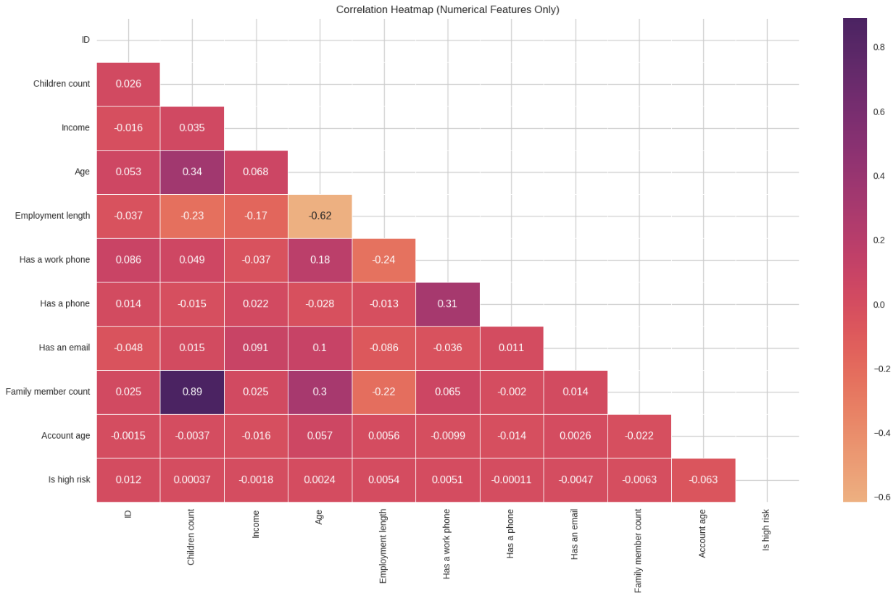
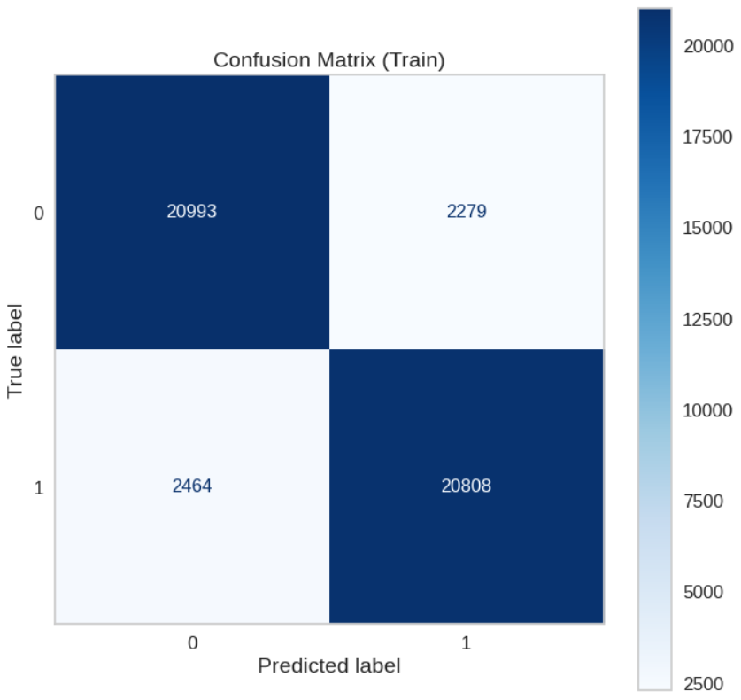
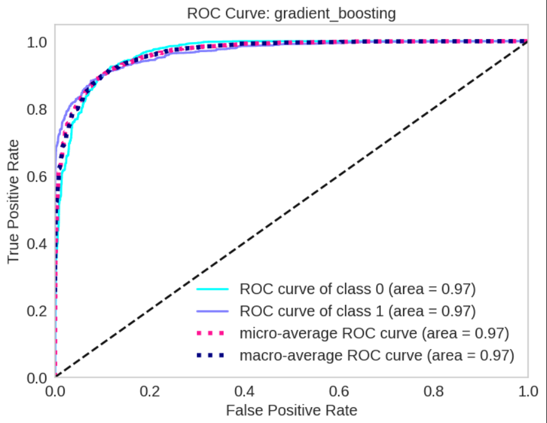

# Credit Card Approval Prediction App

A modern, interactive Streamlit web app to predict credit card approval chances using a machine learning model trained on a Kaggle dataset. The app provides a user-friendly interface, grouped input fields, and clear model explanations with SHAP.

---

## 🚀 Features
- Clean, modern Streamlit UI with grouped and tooltipped input fields
- Animated headings and custom CSS for a professional look
- Sidebar with app info and credits
- Input summary table for user review
- Data preprocessing pipeline with outlier removal, encoding, scaling, and SMOTE balancing
- Loads model and data locally (no cloud dependencies)
- **Model explainability with SHAP: see which features most influenced your approval prediction**
- Ready for local use or deployment

---

## 📝 How to Use
1. Clone this repository and install dependencies:
   ```sh
   pip install -r requirements.txt
   ```
2. Run the app:
   ```sh
   streamlit run app.py
   ```
3. Enter your details in the app UI and click "Am I Approved?" to see your prediction and explanation.

---


---

## 📊 Quick Glance at the Results

### Correlation between the features


### Confusion matrix of Gradient Boosting Classifier


### ROC curve of Gradient Boosting Classifier


---

### **Final Model and Evaluation Metric**
- **The final model used is:** Gradient Boosting
- **Metrics used:** Recall

We chose **recall** as the primary metric for evaluating our credit risk model because our main goal is to identify as many actual defaulters as possible. In the context of credit lending, missing a defaulter (a false negative) can lead to significant financial losses for the institution. By focusing on recall, we prioritize minimizing these false negatives, ensuring that most high-risk clients are correctly flagged. While this approach may result in some good clients being incorrectly classified as risky (false positives), we consider this trade-off acceptable because the cost of lending to a defaulter is much higher than denying credit to a safe client. In summary, recall aligns with our objective to reduce the risk of undetected defaults and protect the financial institution from potential losses.

---

## 🔍 Model Explainability with SHAP

This app uses **SHAP (SHapley Additive exPlanations)** to provide clear, visual explanations for each credit card approval prediction.

- **What is SHAP?**  
  SHAP helps you understand how each input feature (like income, age, employment status, etc.) influenced the model's decision for your specific case.
- **How does it work in this app?**  
  After you submit your details, the app shows a SHAP waterfall plot highlighting which features pushed your approval chances up or down.
- **Why is this useful?**  
  - Makes the model's decision transparent and trustworthy.
  - Helps users see which factors are most important for their approval.

---

## �� Project Structure
```
Credit_card_Approval/
├── dataset/
│   ├── application_record.csv
│   ├── credit_record.csv
│   ├── test.csv
│   └── train.csv
├── final_model/
│   └── gradient_boosting_model.sav
├── notebook/
│   └── Credit_Card_Approval.ipynb
├── pandas_profile_file/
│   └── income_class_profile.html
├── app.py
├── requirements.txt
└── README.md
```

---

## 🛠️ Setup Instructions

### 1. Clone the Repository
```sh
git clone <your-repo-url>
cd Credit_card_Approval
```

### 2. Create and Activate a Virtual Environment
```sh
python -m venv venv
# On Windows:
.\venv\Scripts\activate
# On Mac/Linux:
source venv/bin/activate
```

### 3. Install Dependencies
```sh
pip install -r requirements.txt
```

### 4. Ensure Data and Model Files Are Present
- Place your data files in the `dataset/` folder (`train.csv`, `test.csv`, etc.)
- Place your trained model in `final_model/gradient_boosting_model.sav`

---

## 📢 Credits
- Model: Gradient Boosting Classifier
- Dataset: Credit Card Fraud Detection (Kaggle)
- UI & App: Made by Aastha Gupta

---

## 📒 Notebooks & Profiling
- The `notebook/` folder contains the original Jupyter notebook used for data exploration, feature engineering, and model training. You can review the full workflow and experiments there.
- The `pandas_profile_file/` folder contains a pandas profiling HTML report for quick data analysis and insights.

---

## 🤖 Machine Learning Model
- The trained machine learning model is a **Gradient Boosting Classifier**.
- The model is saved as a `.sav` file in the `final_model/` directory: `final_model/gradient_boosting_model.sav`.
- This model is loaded by the Streamlit app (`app.py`) to make real-time predictions based on user input.
- The model was trained using the features and preprocessing pipeline described in the notebook.

---

## 📦 Summary
This project demonstrates a complete machine learning workflow: from data analysis and feature engineering in Jupyter notebooks, to model training and evaluation, and finally to deployment as an interactive web app using Streamlit. All data and models are handled locally for privacy and ease of use. The app is ready for further extension or deployment as needed.

Thank you for checking out this project! 